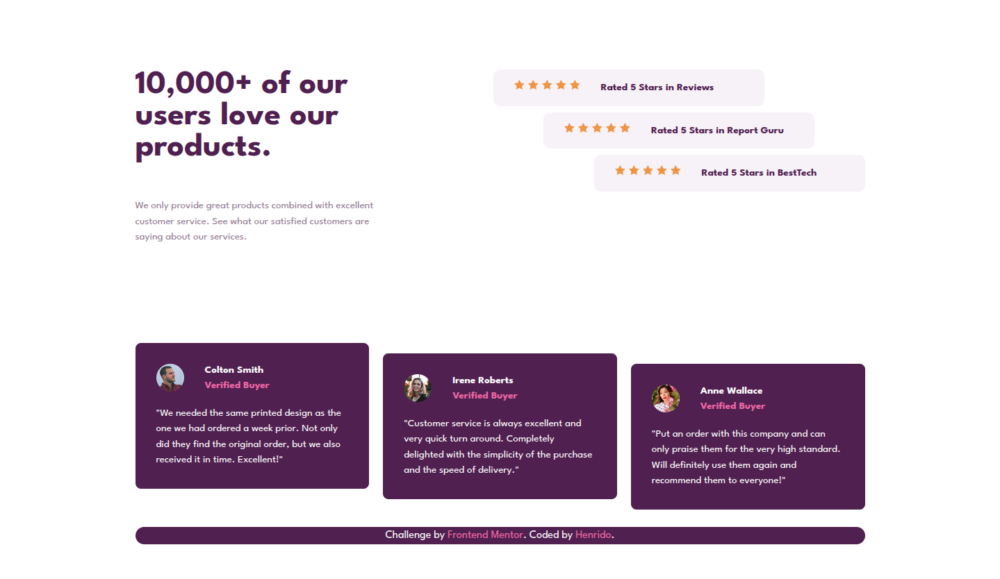

# Frontend Mentor - Social proof section solution

This is a solution to the [Social proof section challenge on Frontend Mentor](https://www.frontendmentor.io/challenges/social-proof-section-6e0qTv_bA). Frontend Mentor challenges help you improve your coding skills by building realistic projects. 

## Table of contents

- [Overview](#overview)
  - [The challenge](#the-challenge)
  - [Screenshot](#screenshot)
  - [Links](#links)
- [My process](#my-process)
  - [Built with](#built-with)
  - [What I learned](#what-i-learned)
  - [Continued development](#continued-development)
- [Author](#author)

## Overview

A social proof section built using HTML and CSS + Flexbox.

### The challenge

Users should be able to:

- View the optimal layout for the section depending on their device's screen size

### Screenshot

.png)

### Links

- Solution URL: 
- Live Site URL: 

## My process

Step 1: View design preview and think of a plan towards using HTML and CSS for this project. 

Step 2: I decided to go with flexbox on this project and created appropriate containers for elements for more flexible layouting with flexbox.

Step 3: Start building HTML and build it so the site is readable and easy to understand even without CSS.

Step 4: Once HTML built, start building the base layout with flexbox for this project with CSS. 

Step 5: Once base layout done and responsiveness acquired start adjusting fonts and colors. 

Step 6: Once all small details are done start testing for bugs in responsiveness.

Step 7: It works as expected! Project done.

### Built with

- Semantic HTML5 markup
- CSS custom properties
- Flexbox

### What I learned

I learned and got a lot of practice on the use of flexbox and relative sizing on elements with relative units.

### Continued development

I wish to learn more about aria attributes even though it's not currently in my learning scope, but i can't wait to learn more about them.

## Author

- Frontend Mentor - [@Henrido-cpu](https://www.frontendmentor.io/profile/Henrido-cpu)
- X - [@HenridoWeb](https://x.com/HenridoWeb)
- Github - [@Henrido-cpu](https://github.com/Henrido-cpu)
- Instagram - [@henridoweb](https://www.instagram.com/henridoweb/)

